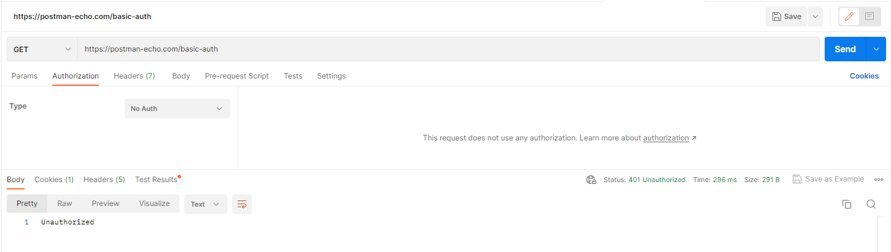

API Assignment 04/30/2023

1. Get authentication token using URI: https://postman-echo.com/basic-auth
   Question:

a. How did you get the response?
> Unauthorized

2. Get information about all users using URI: https://reqres.in/api/users
   Question:

a. How many lists can you see in the response body?
> One list named "data"

3. Get information about the user with id 3 using URI: https://reqres.in/api/users/3
   Question:

a. How many lists can you see in the response body?
>Ans:  No list, no square bracket

b. What are the available property(Key) names in the response body?
>Ans:  Under the object/primary key "data" it has five keys and under the object/primary key "support" it has two keys

4. Delete the User with id 9 using URI https://reqres.in/api/users/9
   Question:

a. What is the response?
>Ans: Status 204: No content

b. How many users are now on the users list? https://reqres.in/api/users
>Ans: 12 users

c. Can you see the deleted user record?
>Ans: Yes, because it did not delete the record

5. Get information of the user with id 40 using URI: https://reqres.in/api/users/40
   Question:

a. How many lists can you see in the response body?
>Ans: No response, Status 404 not found

b. What are the available property(Key) names in the response body?
>Ans: No property key available

6. Create a new user in a system using URI: https://reqres.in/api/users Verb: POST Request Body:

        { 
          "name": "yourname",  
          "job": "dreamjob"
        }
img.png

Question:
a. What is the response code?
>Ans: Status 201 Created

b. What are the available property(Key) names in the response body?
>Ans:8 keys in header

c. What is the value of response Header Etag?
>Ans: W/"5d-qdn3Xvr9Z7aiUXrVjg29BCw/QKQ"

7. Sign in to the system using URI: https://reqres.in/api/login and {"email": "peter@klaven"}

Question:
What is the response code?
>Ans: Status 200

8.Sign in to the system using URI: https://reqres.in/api/login and
{
"email": "eve.holt@reqres.in",
"password": "cityslicka"
}

Question:
a. What is the value of response Header Etag?
>Ans: W/"2c1-N6Rqerxquq2kgQhL51EiSg4x0R8"

b. What is the response?
>Ans: Status 200

9. Get information about all planets using URI: https://swapi.dev/api/planets. Carefully observe the response body and make a list of all attributes and write their data types.
>Ans: 
> There are objects, that starts and ends with {}
> There are strings, that starts and ends with ""
> There are numbers
> There are null values, as NULL
> There are arreys, that starts and ends with []
   
Question:
How many lists can you see in the response body?
>Ans: Primarily there is one list "results", under results there are two list "residents" and "films"

10. Get information about the third planet using URI: https://swapi.dev/api/planets/3/
    Question:
    How many properties you can see in response body?
>Ans: No properties in response body, 10 properties in response header

11. Get information about all the starships using URI: https://swapi.dev/api/starships. Carefully observe the response body and make a list of all attributes and write their data types.
    Question:
    How many lists can you see in the response body?
>Ans:
> There are objects, that starts and ends with {}
> There are strings, that starts and ends with ""
> There are numbers
> There are null values, as NULL
> There are arreys, that starts and ends with []

12. Get information about the ninth starship using URI: https://swapi.dev/api/starships/9/
    Question:
    How many lists can you see in the response body?
>Ans: Two lists, "pilots" and "films"

13. Get information about all films using URI: https://swapi.dev/api/films. Carefully observe the response body and make a list of all attributes and write their data types.
    Question:
>Ans:
> There are objects, that starts and ends with {}
> There are strings, that starts and ends with ""
> There are numbers
> There are null values, as NULL
> There are arreys, that starts and ends with []
    
How many lists can you see in the response body?
>Ans: Initially one lists called "results" under "results" there are few lists as: characters, planets, starships, vehicles, species

14. Get information about the third planet using URI: https://swapi.dev/api/species
    Question:
    How many lists can you see in the response body?
>Ans: Initially one lists called "results" under "results" there are 37 records and there are "peoples" and "films" in each records

15. Get all booking ids using URI: https://restful-booker.herokuapp.com/booking
    Question:
    How many lists can you see in the response body?
>Ans: One list

16. Get details about booking id 23 using URI: https://restful-booker.herokuapp.com/booking/23
    Question:
    What is the response?
>Ans: Status 200 OK

17. Get details about booking id 3 using URI: https://restful-booker.herokuapp.com/booking/3
    Question:
    What is the response?
>Ans: Status 200 OK

18. Get information about all planets using URI: https://swapi.dev/api/planets
    Question:
    What is the response?
>Ans: Status 200 OK

How many lists can you see in the response body?
>Ans: >Ans: Initially one lists called "results" under "results" there are 60 records and there are "residents" and "films" in each records

19. Get information about all species using URI: https://swapi.dev/api/species. Carefully observe the response body and make a list of all attributes and write their data types.
    Question:
    How many lists can you see in the response body?
>Ans: Initially one lists called "results" under "results" there are 37 records and there are "peoples" and "films" in each records

  What is the response?
>Ans: Status 200 OK

20. Write JSON path for following JSON file:
    {
    "studio": {
    "movie": [
    {
    "category": "history",
    "director": "John",
    "title": "History",
    "rating": 6.60
    },
    {
    "category": "comedy",
    "director": "Paul",
    "title": "Laugh",
    "rating": 4.00
    },
    {
    "category": "fiction",
    "director": "Jack",
    "title": "Wake",
    "isbn": "87877676879",
    "rating": 8.01
    },
    {
    "category": "drama",
    "director": "Edward",
    "title": "Wuthering Heights",
    "isbn": "8754543578",
    "rating": 4.50
    }
    ],
    "music": {
    "song": "pale",
    "rate": 5.4
    }
    },
    "ranking": 20
    }
    a. To retrieve all direct properties of the studio object
>Ans: .studio
    b. To find out the music’s song
> Ans: .studio.music.song
    c. To find the rating of all items in the studio
> Ans: .studio.movie[0].rating
    d. To retrieve information on all movies
> Ans: 
    e. To find out the titles of all movies
> Ans: .studio.movie[0].title, .studio.movie[1].title, .studio.movie[2].title, .studio.movie[3].title
    f. To retrieve the titles of all movies by Jack
> Ans: .studio.movie[2].director
    g. To retrieve the category of the last movie
> Ans: .studio.movie[3].category
    i. To retrieve all movies that have the isbn property
> Ans: .studio.movie[2].isbn, .studio.movie[3].isbn

21. Get information about all employees using URI: http://dummy.restapiexample.com/api/v1/employees
    Question:
    How many lists can you see in the response body?
>Ans: One list, "data"
    What is the response?
>Ans: Status 200 OK
    What are the available property(Key) names in the response body?
> Ans: No properties in response body, 16 properties in response header
    Make a list of all attributes and write the data types.
>Ans:
> There are objects, that starts and ends with {}
> There are strings, that starts and ends with ""
> There are numbers
> There are null values, as NULL
> There are arreys, that starts and ends with []

22. Get a single employee data using URI: http://dummy.restapiexample.com/api/v1/employee/3
    Question:
    How many data you can see in response body?
> Ans: One data
    What is the response status?
>Ans: Status 200 OK

23.Create a new employee in a system by using URI: http://dummy.restapiexample.com/api/v1/create Verb: POST Request Body:
    {
    "name":"your name",
    "salary":"123",
    "age":"23"
    }

Question:

What is the response?
>Ans: Status 404 Not Found
 
can you see "id" property in the response? if Yes, note the "id" value.
>Ans: No

24. Delete an employee record whose employee id in 2 by using URI http://dummy.restapiexample.com/api/v1/delete/2
    Question:
    What is the response?
>Ans: Status 404 Not Found

    How many employees are now in the employees list? http://dummy.restapiexample.com/api/v1/employees
>Ans: 24 employees
    Can you see the deleted employee record?
> Ans: employee was not deleted

25. Register a user by using
    URI: https://reqres.in/api/register Verb: POST Request Body:
    {
    "email": "john.jack@example.com",
    "password": "@izaanSchool"
    }

Question:
What is the response?
>Ans: Status 400 Bad request
What are the available property(Key) names in the response body?
>Ans: None

26. Get an user Using URL https://reqres.in/api/unknown/2
    Question:

What is the response?
>Ans: Status 200 OK

27. A simple health check endpoint to confirm whether the API is up and running using https://restful-booker.herokuapp.com/ping
    Question:

What is the response?
>Ans: Status 201 created

28. Get information using Delayed Response using URI: https://reqres.in/api/users?delay=3
    Question:

What is the response?
>Ans: Status 200 OK

How many seconds delay to respond?
>Ans: 3.20 s

29. Get information about vehicles using URL https://swapi.dev/api/vehicles/schema/
    Question:

What type of response it is?
>Ans: Not Found

What is response status code?
>Ans: Status 404 Not Found

30. Get information about starships using URL https://swapi.dev/api/starships/schema/
    Question:

What type of response it is?
>Ans: Not Found

Write down the response status code.
>Ans: Status 404 Not Found

What are the available property(Key) names in the response body?
>Ans: None

